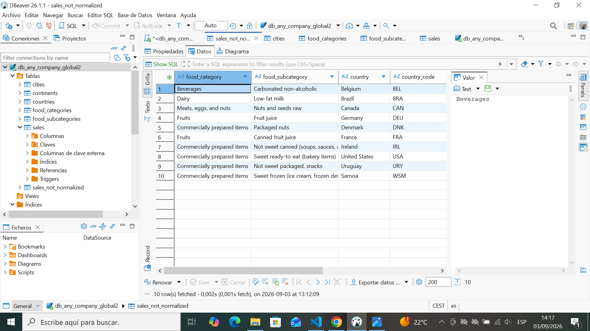
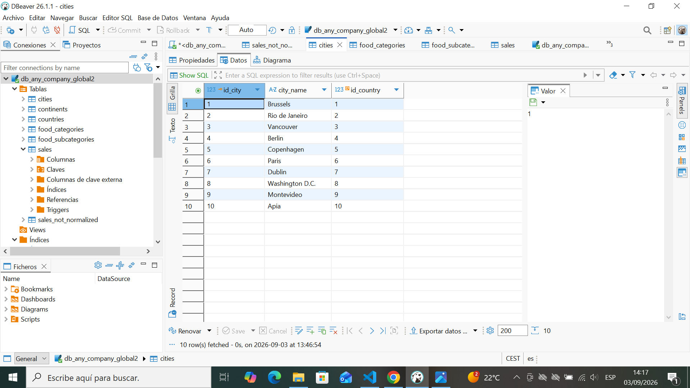
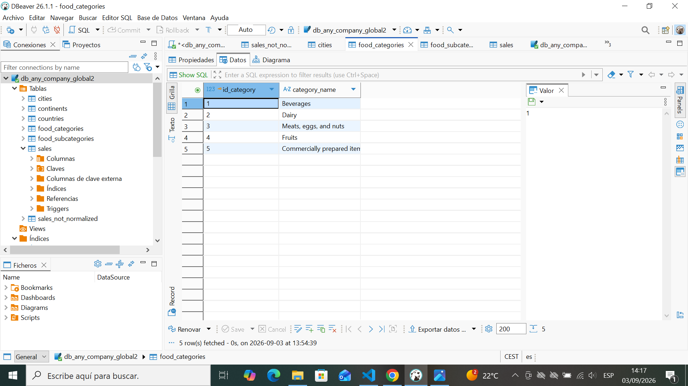
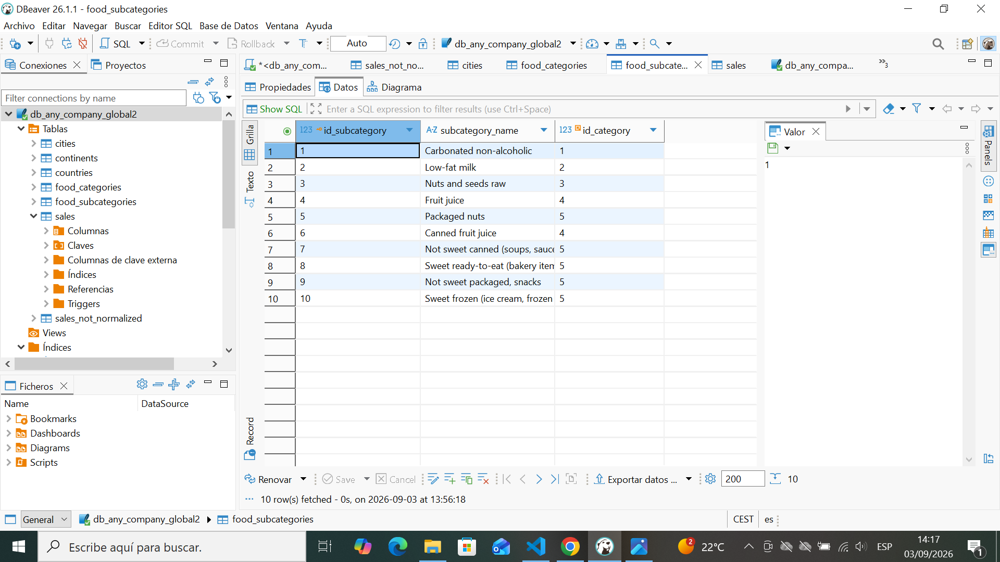
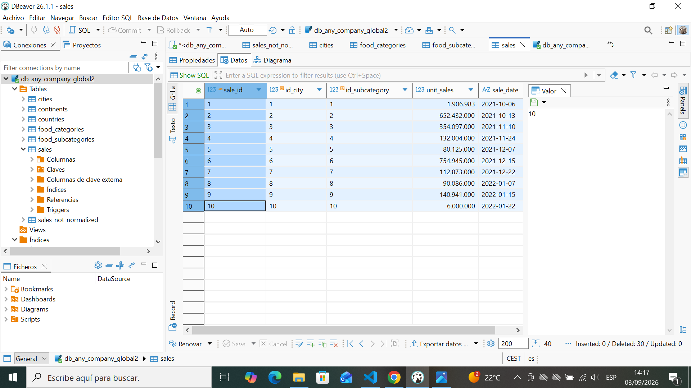

# any_company_global

## Diagrama ER de Chen

## Tabla sin normalizar

## Tablas normalizadas

Cript SQL final:

CREATE TABLE sales_not_normalized (
    food_category VARCHAR(100),
    food_subcategory VARCHAR(100),
    country VARCHAR(50),
    country_code CHAR(10),
    continent VARCHAR(50),
    city VARCHAR(50),
    unit_sales BIGINT,
    date DATE
);

INSERT INTO sales_not_normalized (date,food_category,food_subcategory,country,country_code,continent,city,unit_sales) VALUES
	 ('2021-10-06','Beverages','Carbonated non-alcoholic','Belgium','BEL','Europe','Brussels',1906983),
	 ('2021-10-13','Dairy','Low-fat milk','Brazil','BRA','South America','Rio de Janeiro',652432000),
	 ('2021-11-10','Meats, eggs, and nuts','Nuts and seeds raw','Canada','CAN','North America','Vancouver',354097000),
	 ('2021-11-24','Fruits','Fruit juice','Germany','DEU','Europe','Berlin',132004000),
	 ('2021-12-07','Commercially prepared items','Packaged nuts','Denmark','DNK','Europe','Copenhagen',80125000),
	 ('2021-12-15','Fruits','Canned fruit juice','France','FRA','Europe','Paris',754945000),
	 ('2021-12-22','Commercially prepared items','Not sweet canned (soups, sauces, and more)','Ireland','IRL','Europe','Dublin',112873000),
	 ('2022-01-07','Commercially prepared items','Sweet ready-to-eat (bakery items)','United States','USA','North America','Washington D.C.',90086000),
	 ('2022-01-15','Commercially prepared items','Not sweet packaged, snacks','Uruguay','URY','South America','Montevideo',140941000),
	 ('2022-01-22','Commercially prepared items','Sweet frozen (ice cream, frozen desserts)','Samoa','WSM','Oceania','Apia',6000000);

CREATE TABLE continents (
    id_continent INTEGER PRIMARY KEY AUTOINCREMENT,
    continent_name VARCHAR(50) UNIQUE
);

INSERT INTO continents (continent_name)
SELECT DISTINCT continent FROM sales_not_normalized;

CREATE TABLE countries (
    id_country INTEGER PRIMARY KEY AUTOINCREMENT,
    country_name VARCHAR(50),
    country_code CHAR(10) UNIQUE,
    id_continent INTEGER,
    FOREIGN KEY (id_continent) REFERENCES continents(id_continent)
);

INSERT INTO countries (country_name, country_code, id_continent)
SELECT DISTINCT sn.country, sn.country_code, c.id_continent
FROM sales_not_normalized sn
JOIN continents c ON sn.continent = c.continent_name;

CREATE TABLE cities (
    id_city INTEGER PRIMARY KEY AUTOINCREMENT,
    city_name VARCHAR(50),
    id_country INTEGER,
    FOREIGN KEY (id_country) REFERENCES countries(id_country)
);

INSERT INTO cities (city_name, id_country)
SELECT DISTINCT sn.city, co.id_country
FROM sales_not_normalized sn
JOIN countries co ON sn.country_code = co.country_code;

CREATE TABLE food_categories (
    id_category INTEGER PRIMARY KEY AUTOINCREMENT,
    category_name VARCHAR(100) UNIQUE
);

INSERT INTO food_categories (category_name)
SELECT DISTINCT food_category FROM sales_not_normalized;

CREATE TABLE food_subcategories (
    id_subcategory INTEGER PRIMARY KEY AUTOINCREMENT,
    subcategory_name VARCHAR(100),
    id_category INTEGER,
    FOREIGN KEY (id_category) REFERENCES food_categories(id_category)
);

INSERT INTO food_subcategories (subcategory_name, id_category)
SELECT DISTINCT sn.food_subcategory, fc.id_category
FROM sales_not_normalized sn
JOIN food_categories fc ON sn.food_category = fc.category_name;

CREATE TABLE sales (
    sale_id INTEGER PRIMARY KEY AUTOINCREMENT,
    id_city INTEGER,
    id_subcategory INTEGER,
    unit_sales BIGINT,
    sale_date DATE,
    FOREIGN KEY (id_city) REFERENCES cities(id_city),
    FOREIGN KEY (id_subcategory) REFERENCES food_subcategories(id_subcategory)
);

INSERT INTO sales (id_city, id_subcategory, unit_sales, sale_date)
SELECT ci.id_city, fs.id_subcategory, sn.unit_sales, sn.date
FROM sales_not_normalized sn
JOIN cities ci ON sn.city = ci.city_name
JOIN food_subcategories fs ON sn.food_subcategory = fs.subcategory_name
ORDER BY sn.date;

DELETE FROM sales;

DROP TABLE sales;

CREATE TABLE sales (
    sale_id INTEGER PRIMARY KEY AUTOINCREMENT,
    id_city INTEGER,
    id_subcategory INTEGER,
    unit_sales BIGINT,
    sale_date DATE,
    FOREIGN KEY (id_city) REFERENCES cities(id_city),
    FOREIGN KEY (id_subcategory) REFERENCES food_subcategories(id_subcategory)
);

INSERT INTO sales (id_city, id_subcategory, unit_sales, sale_date)
SELECT ci.id_city, fs.id_subcategory, sn.unit_sales, sn.date
FROM sales_not_normalized sn
JOIN cities ci ON sn.city = ci.city_name
JOIN food_subcategories fs ON sn.food_subcategory = fs.subcategory_name
ORDER BY sn.date;

SELECT co.country_name
FROM sales s
JOIN cities ci ON s.id_city = ci.id_city
JOIN countries co ON ci.id_country = co.id_country
WHERE s.sale_id = 3;